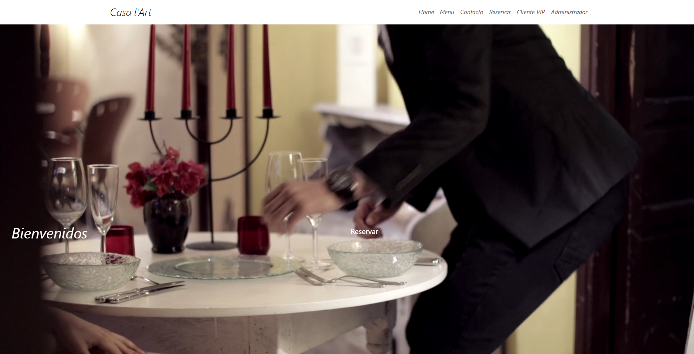
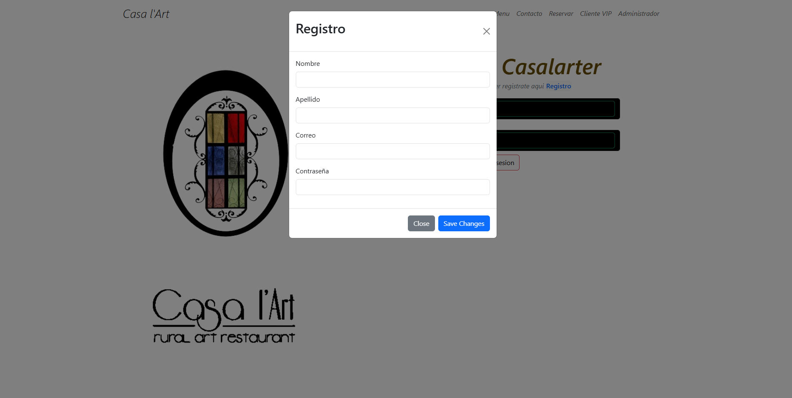
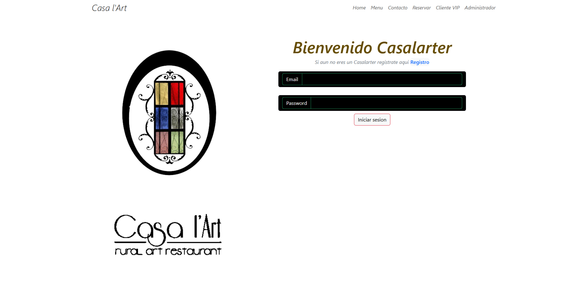
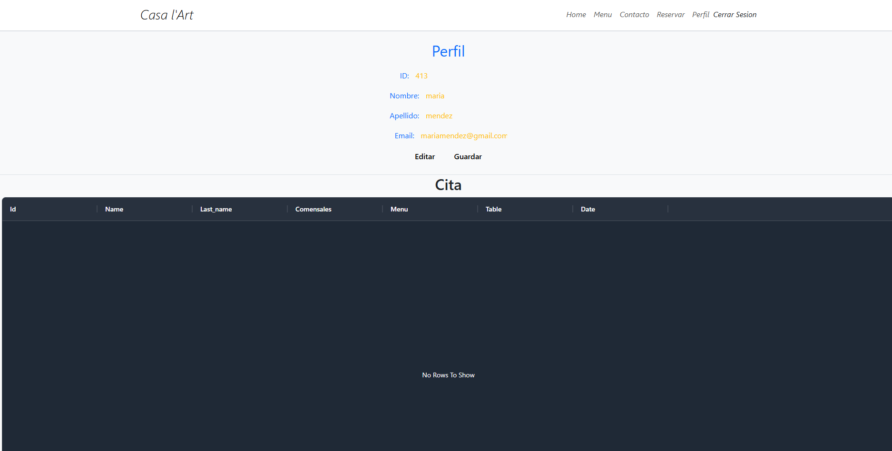
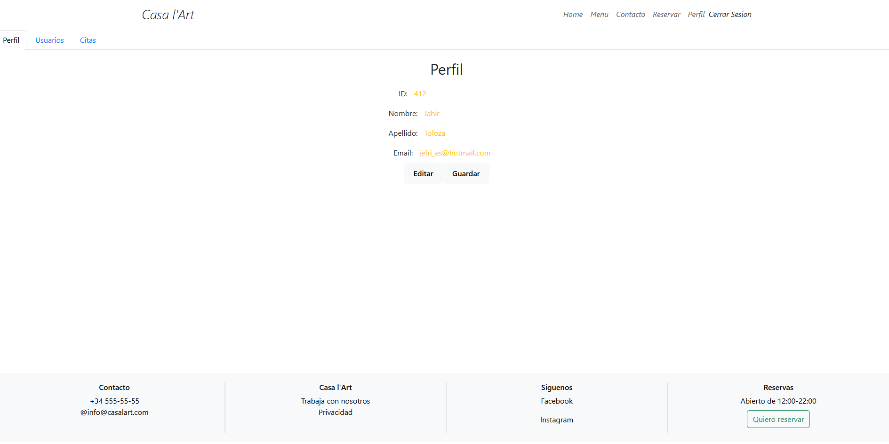
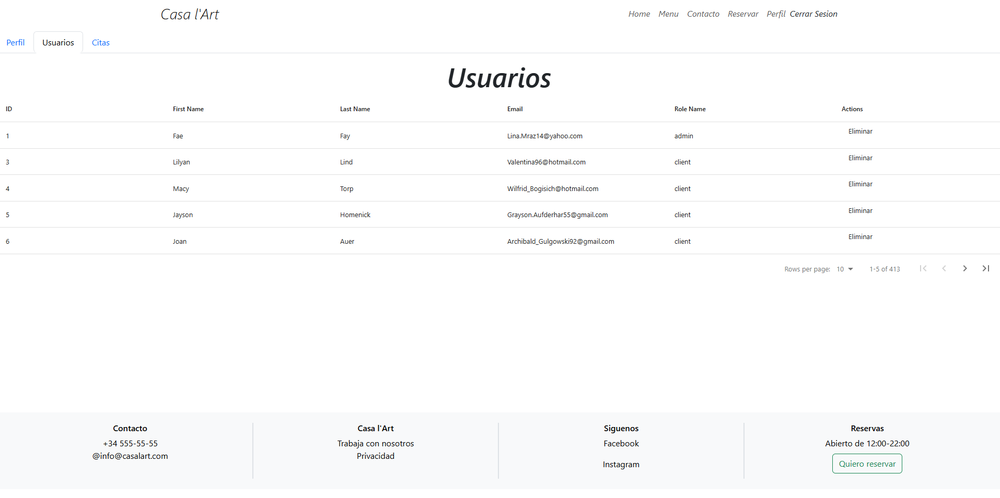
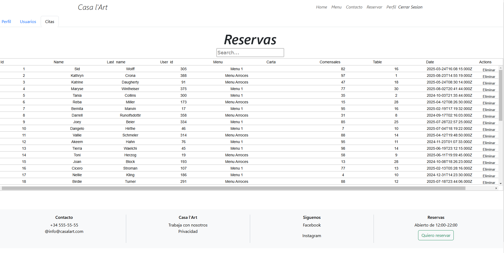

### PROYECTO FRONT-END  ESTUDIO DE TATUAJES 


## Descripcion 

Este proyecto he realizado la parte (frontend) de un sistema de gestión de reservas para un Restaurante. La aplicación permite a los usuarios registrarse, hacer login para clientes VIP, acceder a su área de cliente y gestionar sus reservas. Además, proporciona funcionalidades especiles para el administrador, como la gestión de usuarios y reservas.


## Tabla de Contenidos 🗒️
- [Tecnologias](#capturas-de-pantalla)
- [Capturas de Pantalla](#capturas-de-pantalla)
- [Contribución](#contribución)
- [Desarrollo Local](#desarrollo-local)
- [Backend](#backend)
- [Ejecutar la aplicacion](#ejecutar-la-aplicacion)
- [Licencia](#licencia)
- [Contacto](#contacto)


## Tecnologias 💻

En este proyecto he utlizado las siguientes tecnologias 

1. HTML.

2. CSS.

3. JavaScript (ES6).

4. React.

5. Typescript.

6. Bootstrap.

7. Redux.


## Capturas de Pantalla 📸
INICIO

REGISTRO

LOGIN


VISTA DE PERFIL Y CITA DESDE UN USUARIO-CLIENTE LOGEADO

PERFIL DE USUARIO-ADMINISTRADOR

USUARIOS COMO ADMINISTRADOR

CITAS COMO ADMINISTRADOR



## Contribución 💬
Este proyecto es público, y las contribuciones son bienvenidas. Si deseas contribuir, sigue estos pasos:

1. Haz un fork del repositorio.
2. Crea una nueva rama para tu contribución.
3. Realiza tus cambios y mejoras.
4. Envía una pull request para revisión y fusión.


## Desarrollo Local 🔨
Si deseas contribuir o realizar modificaciones locales al proyecto, sigue estos pasos:
1. Clona este repositorio:
```
  git clone https://github.com/Jahirtoloza14/FRONT-END-STUDIO-TATTOO
```
2.Abre el proyecto en tu editor de código favorito.
3.Realiza las modificaciones o contribuciones deseadas en los archivos .js y .css. 
4. Para ver tus cambios localmente, simplemente abre el archivo HTML en un navegador.

## Backend ⚙️
Este proyecto depende del backend para su funcionalidad completa. Asegúrate de tener el backend instalado y en ejecución antes de iniciar la aplicación frontend. Puedes encontrar el código fuente del backend en el siguiente repositorio: [Backend Repository](https://github.com/Jahirtoloza14/Casa-l-Art-Back-end--Proyecto-Final/tree/main).

Sigue las instrucciones en el repositorio del backend para clonar y ejecutar el servidor.

### Ejetuctar la aplicacion 📌
1. Una vez instaladas las dependencias y con el backend en ejecución, inicia la aplicación con el siguiente comando:
```
    npm run dev
```
2. Abre tu navegador y visita http://localhost:3000/ para visualizar la aplicación.

## Licencia 💳

Este proyecto está bajo la licencia MIT. Ver el archivo   para más detalles.
